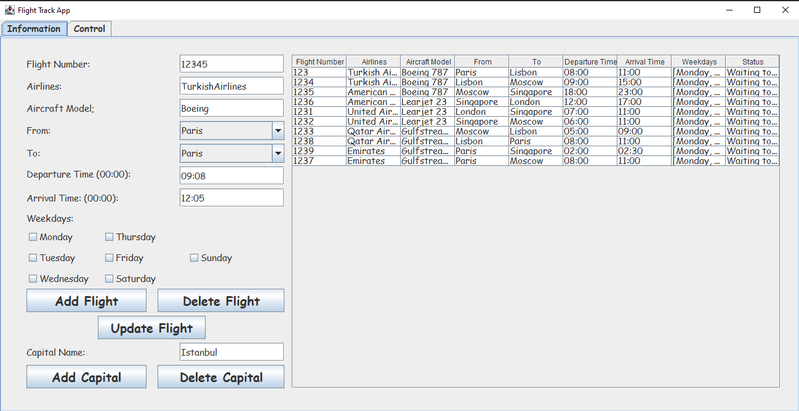
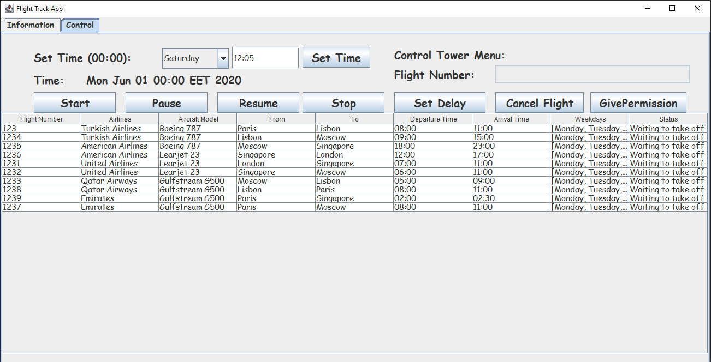
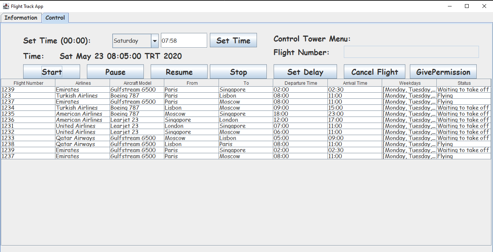
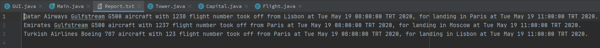

# Flight Track Application in Java
> The flight track application is a flight control simulation. There are flights between capitals, and when the departure time comes, the flight takes off, and when their arrival time comes, flight lands.

## Used Technologies

I used the Java programming language in this project because the object-oriented programming approach is the most appropriate approach for this project. I also used Java Swing framework for Graphical User Interface

## How the program works

- There are five capitals and ten flights between these capitals at the beginning of the program.

- The user can add new capitals, flights.

- The user can update the information of flights.

- The user sets system time, and flights take off and land when their time is up. Each flight is a thread.

- Every minute in the system represents 1 second in real life.

- There is a control tower in the system, and this control tower sets delays and gives permission for landing or cancels the flight.

## Screenshots

